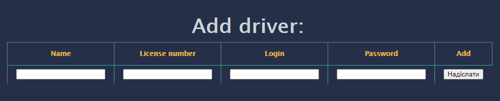
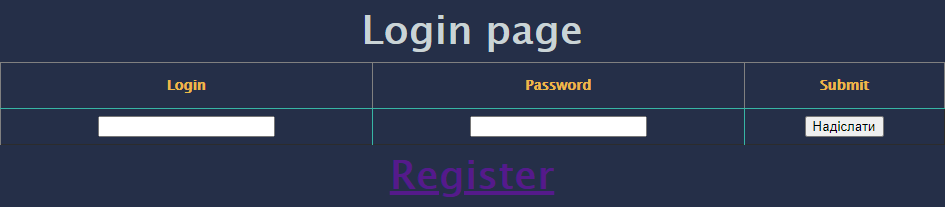
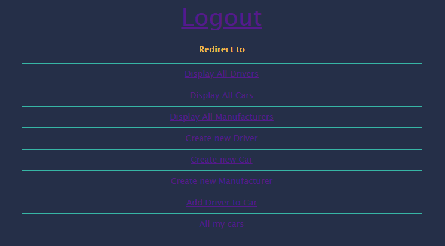
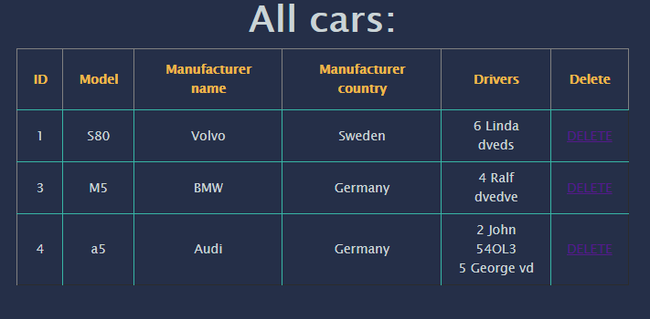

# TAXI SERVICE
This is an imitation of a taxi fleet management program. 
The service allows registration and authentication drivers, logout, add a new car to the database, assign a car to a driver, and it is also possible to delete this data and so on. 
The project is provided with a simple graphical shell using HTML and CSS. 
The project was built in accordance with the principles **SOLID** and **layered architecture**.

### Screenshots
##### *registration:* 

##### *login:* 

##### *main menu:* 

##### *all cars:* 

### The project used:
- Java WEB, Servlets, JDBC;
- HTML, CSS, JSP, JSTL;
- MySQL
- Tomcat;
- Maven;
- Log4j.

### To run the program:
- clone the project;
- configure the database connection file - ConnectionUtil;
- configure Tomcat.

